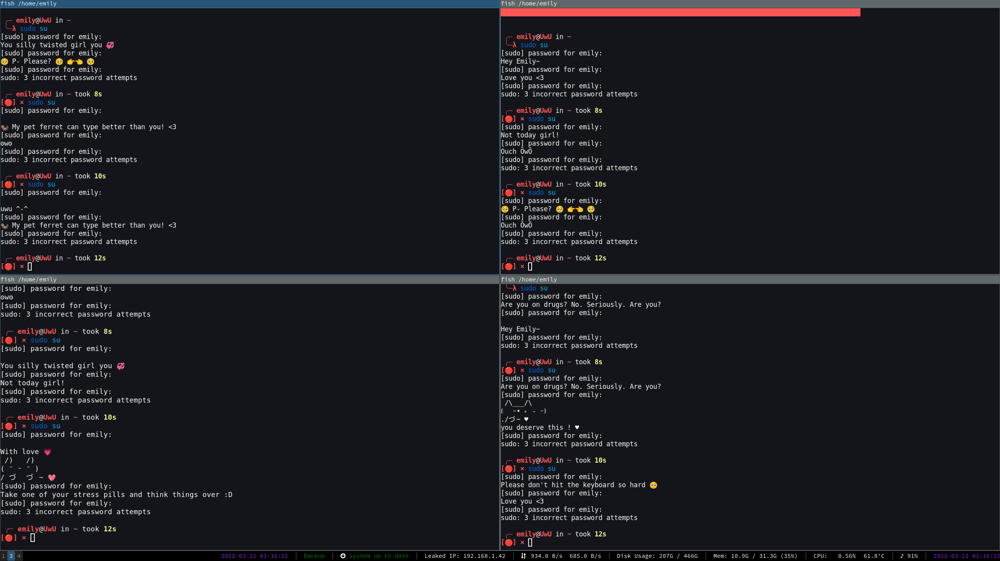

# Girl-ify your sudo experience

## Motivation

The default sudo insults assume the viewer is male. I've been increasingly annoyed by that and decided to change this
behaviour. The only way to set your own insults is by setting `badpass_message`. This has the limitation of being a
single, hard-coded message rather than a list of insults.

So I've decided to create my own workaround.

#### This is  how it looks


## Installation

## Danger mitigation: root shell

First make sure to open a root-shell just to be sure. You're messing with `sudo` here and, if you shoot yourself in the
foot, you want to be able to recover that easily.

To create a new root shell type the following into your favorite shell

```shell
sudo su
```

Now just leave it open until the installation ends. If anything breaks, you can recover by executing

```shell
cp /home/{your username}/.cache/sudo/sudoers.so.bak /usr/lib/sudo/sudoers.so
```

You could of course also use other tools like `doas`.

## Installation

Install with the following

```shell
git clone https://github.com/Emily3403/Suwudo
cd Suwudo
./suwudo.py
```

You will also have to enable insults for `sudo` if you haven't already.
Do so by adding the following to your `/etc/sudoers` file

```
Defaults insults
```

## How does it work?

According to [this](https://unix.stackexchange.com/a/81719) Stackoverflow post the only way to create custom insults is
by recompiling `sudo` from source.

### Why is this bad?

If you compile and maintain your own `sudo` you may be vulnerable to a 0-Day exploit. You can mitigate this by always
keeping it up to date, but this design is not secure by default.

### So how does it work?

The `sudo` binary depends on a shared object located at `/usr/lib/sudo/sudoers.so`. In it various thing are defined, for
example the default insults. You can check them out by opening the object with any text editor and searching for the
string "Dave". It will take you directly to the place where all the insults are stored.

Now we can simply replace the offending characters by new ones.

## Testing the new insults

You can try out the insults by opening a new terminal and executing

```shell
sudo su
```

Now fail a few times :D


## Contributing

If you have any ideas on new insults or improvements for existing ones feel free to submit a pull request. They
are greatly appreciated.
